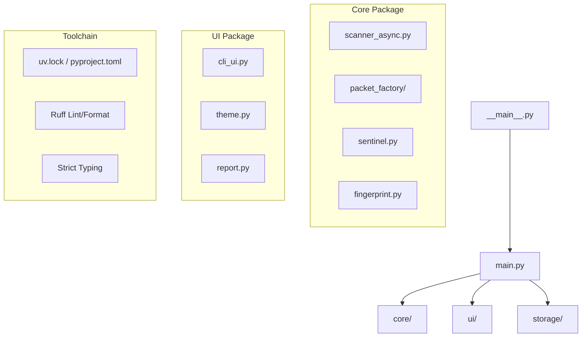

<div align="center">

# 🛡️ Argos Network Intelligence Pro
### Enterprise Security & Packet Engineering Suite

[](https://github.com/TirsoTormo/argos-net-intelligence)
[](https://www.python.org/downloads/)
[](LICENSE)
[](#)

*An elite cybersecurity suite designed for system administrators (ASIR) and network engineers.*

[Features](#features) • [Installation](#installation) • [Usage](#usage) • [Architecture](#architecture) • [Disclaimer](#disclaimer)

</div>

---

## 📖 Overview

**Argos** is a high-performance, command-line network auditing tool built entirely in Python. Evolving from a simple Layer 2/3 network scanner into a full-fledged **Enterprise-Grade** intelligence suite, Argos integrates active network discovery, synthetic packet injection (Packet Factory), and L7 Application Service profiling into a highly visual, cinematic Terminal UI (TUI).

> [!IMPORTANT]
> **v2.0.0-Pro Update**: The suite has been refactored for **High-Performance Async I/O**, **Pydantic Data Integrity**, and includes the new **Sentinel Passive IDS** mode.

Built with the **"Elite Purple"** design aesthetic using Rich, Argos is meant to be the Swiss Army Knife for offensive and defensive network operations.

## ✨ Features

- **⚡ Resilient Auto-Discovery (L2/L3)**: High-speed ARP scans and ICMP ping sweeps with an integrated, multi-threaded Vendor MAC lookup engine, fortified with local JSON caching and Layer 2 fallover (Scapy L3 socket fallback).
- **🕵️‍♂️ L7 Service & Heuristic Intelligence**: Aggressive Banner Grabbing and **OS Fingerprinting**. Argos analyzes TTL, TCP Window, and MSS artifacts to guess the target OS (Windows/Linux/IoT/Network).
- **🛡️ Sentinel Mode (Passive IDS)**: Real-time network monitoring for ARP Spoofing, rogue DHCP servers, and suspicious traffic patterns without sending a single packet.
- **⚡ Pro Async Scanner**: High-concurrency `asyncio` engine capable of scanning 1000+ ports in seconds with near-zero thread overhead.
- **✅ Pydantic Data Integrity**: Strict validation of all network models (Devices, Scan Results, QoS) ensuring enterprise-grade data reliability.
- **🏭 Packet Factory (Modular Package)**: Re-engineered into a clean, layer-based architecture (L2, L3, L4 modules).
  - Custom TCP Segments with specific flags (`SYN`, `ACK`, `FIN`, `RST`).
  - UDP Probing and ICMP payload control.
  - Evasion techniques and manual Traceroutes via custom TTL manipulation.
  - **Auto-Installer**: Intelligent Npcap (v1.71) silent installer for Windows systems.
- **📊 QoS & Security Audit**:
  - **VoIP Analyst**: Async-ready measurement of Jitter and Packet Loss with G.711 simulation.
  - **DHCP Rogue Discovery**: Detect unauthorized DHCP servers.
  - **SSL/TLS Audit**: Deep inspection of certificates and cipher versions.
- **🎥 "Cinema" UX Dashboard**: Live, Matrix-style animated tables and a new **Sentinel Live Log** panel.
- **💾 Audit Persistence**: All scans are automatically archived into a local SQLite database and can be exported to JSON, Markdown, or CSV.

---

## 🚀 Installation & Developer Workflow

Argos now uses **uv** for blazing-fast dependency management and **Standardized Developer Workflows** via `Makefile`.

### 1. Prerequisite: Install uv
```powershell
# Windows (PowerShell)
powershell -c "irm https://astral.sh/uv/install.ps1 | iex"
# Linux / macOS
curl -LsSf https://astral.sh/uv/install.sh | sh
```

### 2. Setup Project
```bash
git clone https://github.com/TirsoTormo/argos-net-intelligence.git
cd argos-net-intelligence

# Sync environment and install dependencies
make sync
```

### 3. Developer Commands
| Command | Result |
| :--- | :--- |
| `make dev` | Run Argos in interactive mode |
| `make lint` | Run Ruff for coding standards |
| `make fmt` | Auto-format code with Ruff |
| `make typecheck` | Strict static analysis with Mypy |
| `make test` | Run the Pytest suite |

---

## 💻 Usage

Argos can be run via the `make` commands or directly using `uv run`.

### Interactive Mode (TUI)
```bash
# Using Makefile
make dev

# Using uv directly
uv run python -m argos
```

### Direct CLI Flags (Unattended)
```bash
# Network Discovery
uv run python -m argos --scan
uv run python -m argos --interfaces

# Packet Factory (Requires Admin/Root)
uv run python -m argos --probe 192.168.1.1 --ports web
uv run python -m argos --dst 192.168.1.1 --flags S --port 443
uv run python -m argos --traceroute 1.1.1.1

# LAN Speed Test
uv run python -m argos --server
uv run python -m argos --client <SERVER_IP>
```

---

## 🏗️ Clean Architecture (Pro Edition)

The project has been refactored into a **Modern Python Project Structure** (`src` layout) for maximum scalability and distribution readiness.



---

## 🛣️ Roadmap

- [x] **v1.1.0**: Concurrent OUI Lookup & Architectural Decoupling.
- [x] **v1.2.0**: L7 Service Intelligence & TUI Cinema Rendering.
- [x] **v2.0.0**: **Architecture Overhaul** (src layout, uv, Ruff, Mypy, Async Engine).
- [x] **v2.0.1**: **Sentinel Passive IDS** & AI-Enhanced Fingerprinting.
- [ ] **v2.1.0**: Deep Packet Anomaly Detection (Visual Flow analysis).

---

## ⚖️ Disclaimer

Argos is a tool intended strictly for **authorized network auditing**, educational purposes, and systems administration tasks. The creators and contributors are **not responsible** for any misuse, damage, or illegal activities caused by the execution of this software. Always ensure you have explicit, written permission to audit the target network.

---
<div align="center">
  <i>Developed with precision and passion for Network Engineers.</i>
</div>